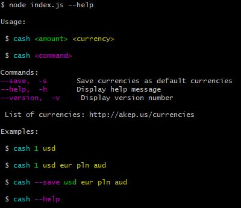

# CASH


## Introduction
The cash library will allow you to compute the value of a currency into another. It is a very simple tool that instantly gives you the result, just by typing a single command.
In this read me, you'll find:


**Table Of Content**
- [How do I Download The folder?](#How-do-I-Download-The-folder)
- [How do I Install Node.js?](#How-do-I-Install-Node.js)
- [How do I install the library?](#How-do-I-install-the-library)
- [How do I Use It?](#How-do-I-Use-It)


## How do I Download The folder

First you'll have to download the folder.

For a github folder, go to this [page](https://github.com/RobinBeuzeboc/3-musketeers)
1. Fork the project via `github`
2. Clone your forked repository project `https://github.com/YOUR_USERNAME/3-musketeers`
```sh
❯ cd /path/to/workspace
❯ git clone git@github.com:YOUR_USERNAME/3-musketeers.git
```

For any user, you can still do it the hard way by downloading the zip folder on this [page](https://github.com/RobinBeuzeboc/3-musketeers)
Then, just unzip the folder.

The fun part is about to begin.


## How do I Install Node.js


The first step to access the features of the library is to install node.js, otherwise, you'll get errors.

_ If you're a **Windows User**, then follow the steps on this [great tutorial](http://blog.teamtreehouse.com/install-node-js-npm-windows).

_ If you're a **Linux User**, then you'll prefer to take this [tutorial](https://doc.ubuntu-fr.org/nodejs) and start from "Depuis un Personal Package Archives (PPA) (dépôts officiels "nodesource")" to get the full extent of node.js

## How do I install the library
Once you installed node.js, you can proceed to install all the dependencies required for the librairy to work.

1. Open a terminal or a cmd
2. Enter the folder path, using the cd /path/to/workspace command until you're in the **/3-musketeers/cash** folder
Once you're here:
```sh
> npm install
```
This command allow the depencies to be install via node.js, it is much faster and easier and make web application really fast to execute.

3. Wait for all the depencies to be installed. Then go in the bin folder.
```sh
> cd bin
```

## How do I Use It
To use the library the first time, you can just type:
```sh
> node index.js --help
```
It will give you all the possible command to type.




Just try yourself!
```sh
> node index.js 1 USD eur pln aud
```
```sh
> node index.js 1 EUR
```

The **save** command will allow you to modify the targeted currencies.
```sh
> node index.js --save usd eur pln aud or whatever you wants
```

As you can see, you can use the library in several ways.
You also have some exemples. Do not forget to go on this [page](http://askep.us/currencies) to see what are the available currencies.

*Do not forget that you need an internet connection, since we use an online API*


